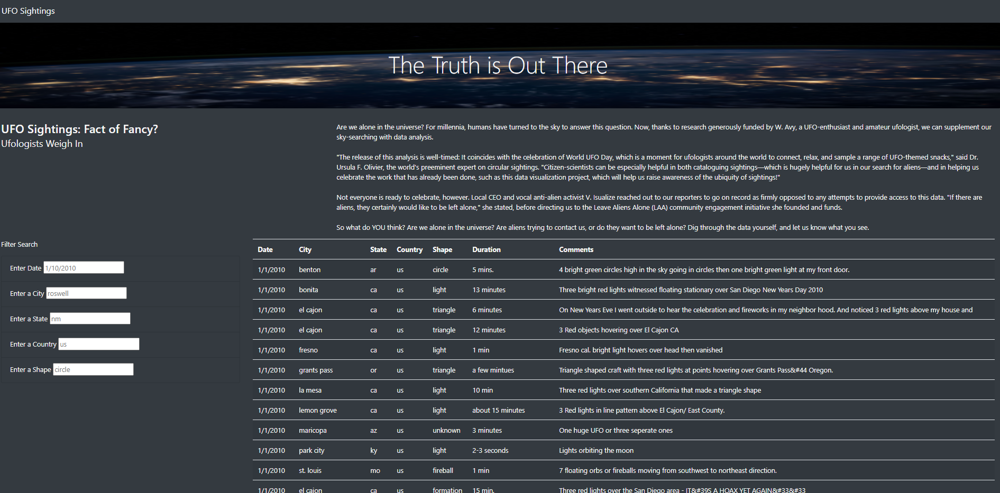
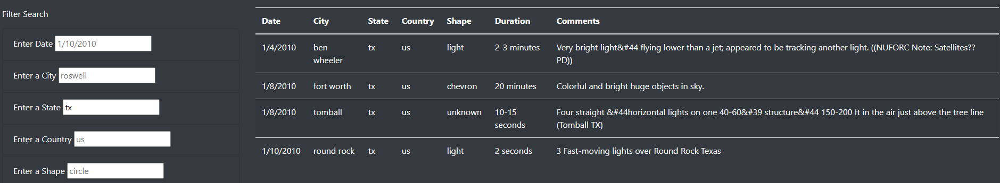
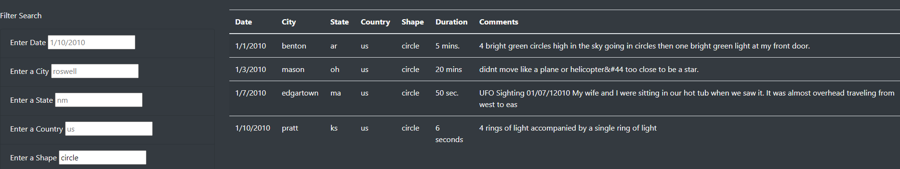

# Building a Webpage for UFO Sightings

## 1) Overview

Update the UFO sightings page to provide a more in-depth analysis by allowing users to filter for multiple criteria at the same time. Specifically, add table filters for the city, state, country, and shape.

## 2) Results

To analyze the data, start at the homepage below:

Next, you simply need to enter the relevant information in one or more of the filters to the left of the table. For example, if you wanted to see how many sightings there were in the state of Texas, simply type "tx" in the state search bar and hit enter. The following will appear:

Another search might be to see how many sightings fit a certain shape. In the case below, we searched for how many sightings were designated as a "circle" shape:

## 3) Limitations and Recommendations

One limitation to the webpage is not including filters for the other columns in the tabe (Duration, Comments). In addition to being a basic UX improvement, there could be intersting data to parse regarding the duration and comments of various UFO sightings. Some recommendations for future development would be: (a) expanding the dataset outside of sightings in 2010; (b) expanding the dataset to include sightings outside of the United States; (c) adding the previous mentioned filters for duration and comments; (d) adding additional elements to the dataset like links to videos, news articles, etc.; or (e) adding an export feature so users can export their queries.

## 4) Key files and data sources

1) [app.js](static/js/app.js)
2) [data.js](static/js/data.js)
3) [app.py](app.py)
4) [index.html](templates/index.html)
5) [chromedrive.exe](chromedriver.exe)
6) [style.css](static/css/style.css)
7) [nasa.jpg]()